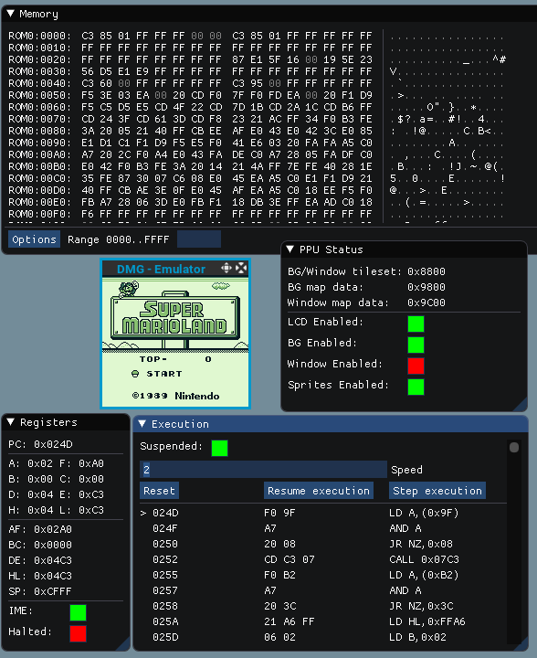

# DMG emulator

Personal attempt at creating a simple DMG GameBoy emulator from scratch.

# Documentation

* [The Ultimate Game Boy talk](https://www.youtube.com/watch?v=HyzD8pNlpwI) at 33c3
* [Why did I spend 1.5 months creating a Gameboy emulator?](http://blog.rekawek.eu/2017/02/09/coffee-gb/)
* [Z80 Family CPU User Manual](http://www.myquest.nl/z80undocumented/z80cpu_um.pdf)
* [Dooskington wiki about emulators](https://github.com/Dooskington/GameLad/wiki)
* [Pan Docs](http://bgb.bircd.org/pandocs.htm)
* [Game Boy DMG original Boot ROM](http://gbdev.gg8.se/wiki/articles/Gameboy_Bootstrap_ROM)
* [Game Boy Opcodes](http://www.pastraiser.com/cpu/gameboy/gameboy_opcodes.html)
* [Game Boy Opcodes (other version)](https://gamehacking.org/faqs/GameBoy_Z80_Opcode_Map.html)

# Compilation

```
make clean; make
```

Test with `./test`

# Tests
## Blarggs

|# |name               |state             |
|- |-                  |-                 |
|01|cgb_sound          |:no_entry_sign:   |
|02|cpu_instrs         |:heavy_check_mark:|
|03|dmg_sound          |:x:               |
|04|halt_bug           |:x:               |
|05|instr_timing       |:heavy_check_mark:|
|06|interrupt_time     |:x:               |
|07|mem_timing-2       |:grey_question:   |
|08|mem_timing         |:grey_question:   |
|09|oam_bug            |:grey_question:   |

### Blarggs Cpu Instruction

|# |name               |state             |
|- |-                  |-                 |
|01|special            |:heavy_check_mark:|
|02|interrupts         |:heavy_check_mark:|
|03|op sp,hl           |:heavy_check_mark:|
|04|op r,imm           |:heavy_check_mark:|
|05|op rp              |:heavy_check_mark:|
|06|ld r,r             |:heavy_check_mark:|
|07|jr,jp,call,ret,rst |:heavy_check_mark:|
|08|misc instrs        |:heavy_check_mark:|
|09|op r,r             |:heavy_check_mark:|
|10|bit ops            |:heavy_check_mark:|
|11|op a,(hl)          |:heavy_check_mark:|


# TODO

* [x] Implement Z80 instruction set
* [-] Implement interupts
    * [x] V-Blank
    * [x] LCD Stat
    * [x] Timer
    * [ ] Serial
    * [x] Joypad
* [x] Implement MMU
* [x] Implement PPU
* [x] Implement inputs
* [ ] Sound!

# Screenshots



